# CineVault Studio 🎞️
> **Autonomous Multi-Agent Archival Post-Production & NLE AI Engine built on Google Cloud Gemini Enterprise + Parallel API & MCP Server**  
> *Submitted to the Agentic Cinema: The Blockbuster Hackathon (Parallel Partner Track)*

[](LICENSE)
[](server/gemini-agent-client.ts)
[](server/parallel-client.ts)
[](server/mcp-server.ts)
[](premiere-panel/)
[](server/parallel-client.ts)

---

## 0. Executive Summary & Problem

Documentary filmmakers, commercial editors, and newsrooms face three chronic bottlenecks when sourcing archival and historical B-roll:
1. **Extreme Fragmentation**: Millions of historical clips are scattered across 3,000+ disparate archives, government repositories, and commercial libraries with incompatible search semantics.
2. **Pricing Opacity**: License costs fluctuate wildly from **$0** (public domain) to **$200+/second** (rights-managed theatrical), with licensing fees often hidden behind checkout walls or inquiry forms.
3. **Public Domain Copyright Liability**: Thousands of online stock aggregators mislabel commercial or derivative footage as "CC0 / Free Public Domain," creating catastrophic chain-of-title risks for theatrical or streaming distribution.

**CineVault Studio** is an autonomous multi-agent archival post-production and NLE AI engine. A film editor provides a screenplay excerpt or reference image, and CineVault Studio:
- Decomposes the shot into targeted archival queries via **Google Cloud Gemini Enterprise / Vertex AI Agent Builder**.
- Conducts live web-scale searches across **15 Connected Institutional Repositories** (NARA, LOC, NASA, BFI, INA, UCLA, EFG, Smithsonian, IWM, NFB, NFSA, Filmarkivet, NLM, DFI) via the **Parallel Search API & Parallel MCP Server**.
- Deep-scrapes source pages for exact pricing, rights scope, and format via the **Parallel Extract API**.
- Validates copyright claims using a strict, conservative **Public Domain Risk Engine (17 U.S.C. § 105)**.
- Delivers candidates directly to a **standalone web dashboard** and directly inside **Adobe Premiere Pro** via a native UXP panel.
- Exports instant sequence formats: **Adobe Premiere Pro XML (`.xml`)**, **CMX 3600 EDL (`.edl`)**, **DaVinci Resolve / FCPXML (`.fcpxml`)**, and **Metadata CSVs**.

---

## 1. Codebase Proof of Technological Implementation (Judging Reference)

Both **Google Cloud / Gemini Enterprise** and **Parallel** (REST & MCP Protocol) are actively imported and executed at runtime in the code:

| Component | File Reference | Runtime Functionality |
| :--- | :--- | :--- |
| **Gemini Enterprise Agent** | [`server/gemini-agent-client.ts`](server/gemini-agent-client.ts) | Wraps Vertex AI Agent Builder / Gemini Enterprise orchestration loop; coordinates multi-step query decomposition, tool execution, risk assessment, and candidate ranking. |
| **Parallel MCP Server** | [`server/mcp-server.ts`](server/mcp-server.ts) | Exposes `parallel_search`, `parallel_extract`, and `parallel_monitor` as standardized **Model Context Protocol (MCP)** tools. |
| **Parallel Search API** | [`server/parallel-client.ts`](server/parallel-client.ts#L44-L89) | POST to `https://api.parallel.ai/v1/search` with `x-api-key` header to query live web and archival indices. |
| **Parallel Extract API** | [`server/parallel-client.ts`](server/parallel-client.ts#L91-L141) | Calls `https://api.parallel.ai/v1/extract` to pull live pricing, license scope, and copyright assertions off candidate web pages. |
| **Parallel Monitor API** | [`server/parallel-client.ts`](server/parallel-client.ts#L143-L180)<br>[`server/routes/monitor.ts`](server/routes/monitor.ts) | Registers background monitor tasks to watch shortlisted clips for price drops or license alterations. |
| **Judge Inspector & Sandbox** | [`dashboard/index.html`](dashboard/index.html)<br>[`dashboard/app.js`](dashboard/app.js) | Interactive in-browser architecture inspector and live Parallel API key sandbox. |
| **Adobe Premiere Pro UXP** | [`premiere-panel/manifest.json`](premiere-panel/manifest.json)<br>[`premiere-panel/index.js`](premiere-panel/index.js) | Native Premiere Pro panel calling the same backend API to inject shortlisted clips directly into the active project bin. |

---

## 2. Architecture & Multi-Step Agentic Loop

```mermaid
sequenceDiagram
    autonumber
    actor Editor as Film Editor
    participant Dashboard as Web Dashboard / Premiere Panel
    participant Server as Reelfind API / MCP Server
    participant Gemini as Gemini Enterprise / Vertex AI Agent
    participant Parallel as Parallel API (Search/Extract/Monitor)
    participant NARA as Global Archives (NARA / Prelinger / Pathé / Stock)

    Editor->>Dashboard: Input: "1960s factory floor assembly line B&W"
    Dashboard->>Server: POST /api/search-footage (with director filters)
    Server->>Gemini: Trigger Agent Orchestration
    
    rect rgb(30, 40, 60)
    Note over Gemini: Step 1: Query Decomposition
    Gemini->>Gemini: Generate 4-5 archive-targeted subqueries
    
    Note over Gemini,Parallel: Step 2: Parallel Search (REST / MCP)
    Gemini->>Parallel: POST /v1/search (objective + queries)
    Parallel->>NARA: Deep Web Search Across Archives
    NARA-->>Parallel: Candidate pages & metadata
    Parallel-->>Gemini: Structured candidate URLs & excerpts
    
    Note over Gemini,Parallel: Step 3: Parallel Extract (REST / MCP)
    loop For each candidate page
        Gemini->>Parallel: POST /v1/extract (URL, fields: price, rights, PD claim)
        Parallel-->>Gemini: Extracted price, license terms, resolution, provenance
    end
    
    Note over Gemini: Step 4: Conservative PD Risk Audit
    Gemini->>Gemini: Verify against strict institutional allowlist
    
    Note over Gemini: Step 5: Rank & Score Shortlist
    Gemini->>Gemini: Order by visual relevance, license clarity, price
    end

    Gemini-->>Server: Ranked JSON Shortlist + Execution Trace
    Server-->>Dashboard: Return candidates + live tool trace
    Dashboard-->>Editor: Display interactive cards, trace, player, and comparison
    
    opt Premiere Bin Injection
        Editor->>Dashboard: "Import to Project Bin" / "Export Timeline"
        Dashboard->>Editor: Generates XML, EDL (CMX 3600), or FCPXML
    end
```



---

## 3. Conservative Public Domain Risk Engine

A core innovation in Reelfind is the **Conservative Public Domain Risk Engine**:
- **Verified Public Domain (🟢)**: Assigned *only* if the source domain belongs to an authentic institutional repository (`catalog.archives.gov`, `archive.org` Prelinger, `loc.gov`, `images.nasa.gov`, `commons.wikimedia.org`).
- **Unverified PD Claim (🟡)**: If an aggregator or third-party blog claims "CC0" or "Public Domain" without institutional provenance, Reelfind tags it with a **warning alert** advising that underlying corporate chain-of-title or music rights remain unverified.
- **Price Transparency**: If pricing is omitted on the source page, Reelfind outputs `"Unable to verify / Request quote"` rather than fabricating a price.

---

## 4. Quick Start & Local Setup

### Prerequisites
- Node.js 18+ & npm
- Parallel API key from [platform.parallel.ai](https://platform.parallel.ai/)
- (Optional) Google Cloud account with Vertex AI enabled

### 1. Clone & Configure
```bash
git clone https://github.com/your-org/reelfind.git
cd reelfind

# Copy environment variables
cp .env.example .env
```

Edit `.env` and insert your `PARALLEL_API_KEY`:
```ini
PORT=4000
PARALLEL_API_KEY=your_actual_parallel_key
GOOGLE_CLOUD_PROJECT_ID=your_gcp_project_id
```

### 2. Install & Run Server
```bash
cd server
npm install
npm run dev
```

The application is now accessible at:
- **Web Dashboard**: [`http://localhost:4000`](http://localhost:4000)
- **API Status**: [`http://localhost:4000/api/status`](http://localhost:4000/api/status)
- **Premiere Pro Panel View**: [`http://localhost:4000/premiere`](http://localhost:4000/premiere)

### 3. Run Standalone MCP Server
```bash
cd server
node dist/mcp-server.js
```

---

## 5. Adobe Premiere Pro UXP Panel Setup

1. Open the **Adobe UXP Developer Tool** (available via Creative Cloud desktop).
2. Click **Add Plugin** and select the [`premiere-panel/manifest.json`](premiere-panel/manifest.json) file.
3. Launch **Adobe Premiere Pro 2022+**.
4. In the UXP Developer Tool, click **Load** / **Debug** under Reelfind.
5. In Premiere Pro, open **Window → Extensions → Reelfind Footage Finder**.
6. Search for any missing shot; click **"Add to Bin"** to create a clip item directly inside your active Premiere project!

---

## 6. Deploy to Google Cloud Run

```bash
gcloud builds submit --tag gcr.io/YOUR_PROJECT_ID/reelfind
gcloud run deploy reelfind \
  --image gcr.io/YOUR_PROJECT_ID/reelfind \
  --platform managed \
  --region us-central1 \
  --allow-unauthenticated \
  --set-env-vars PARALLEL_API_KEY="YOUR_PARALLEL_API_KEY",GOOGLE_CLOUD_PROJECT_ID="YOUR_PROJECT_ID"
```

---

## 7. 3-Minute Demo Video Script (Judging Guide)

| Timestamp | Section | Visual & Narrative Focus |
| :--- | :--- | :--- |
| **0:00 – 0:25** | **The Problem** | *"Finding archival footage today is broken. Editors waste hours across 3,000+ siloed archives, prices range from \$0 to \$200/second, and mislabeled public domain clips trigger multi-million dollar copyright lawsuits."* |
| **0:25 – 1:10** | **Live Web Dashboard Search** | Type *"black-and-white footage of a crowded factory floor, 1960s, USA"*. Show the **Live Agent Execution Trace** in real time: Gemini Enterprise decomposes the query, calls the **Parallel Search API**, and invokes **Parallel Extract** on each page to pull live prices and rights terms. |
| **1:10 – 1:50** | **Premiere Pro UXP Panel** | Switch to Premiere Pro. Run the search directly from the docked panel. Click **"Add to Bin"** — the archival candidate is instantly created inside the active project bin with full metadata comments. |
| **1:50 – 2:20** | **Parallel Monitor in Action** | Show the **Parallel Price Watchlist**. Click *"Simulate Live Price Drop Alert"* to show Parallel Monitor detecting a price drop and alerting the editor. |
| **2:20 – 2:50** | **Technological Implementation & Trace** | Inspect the trace log payload showing Google Cloud Agent Builder reasoning and the raw `curl /v1/search` and `/v1/extract` requests. Show the **Parallel MCP Server** implementation and conservative Public Domain risk engine. |
| **2:50 – 3:00** | **Roadmap & Vision** | DaVinci Resolve & Avid Media Composer panels, automated direct licensing checkout, and instant proxy generation. |

---

## 8. Hackathon Submission Compliance Checklist

- [x] **Public repository** with full source code, assets, and comprehensive documentation.
- [x] **Open-source LICENSE file** (MIT License) at repository root.
- [x] **Runtime use of Google Cloud / Gemini Enterprise**: [`server/gemini-agent-client.ts`](server/gemini-agent-client.ts).
- [x] **Runtime use of Parallel Search, Extract, and Monitor**: [`server/parallel-client.ts`](server/parallel-client.ts).
- [x] **Model Context Protocol (MCP) Server for Parallel**: [`server/mcp-server.ts`](server/mcp-server.ts).
- [x] **Standalone Web Dashboard**: [`dashboard/index.html`](dashboard/index.html).
- [x] **Adobe Premiere Pro UXP Panel**: [`premiere-panel/manifest.json`](premiere-panel/manifest.json), [`premiere-panel/index.js`](premiere-panel/index.js).
- [x] **Cloud Run ready Dockerfile**: [`Dockerfile`](Dockerfile).
- [x] **Selected Parallel Partner Track** on Devpost.

---

## License
MIT License. Copyright (c) 2026 Reelfind Contributors. See [LICENSE](LICENSE) for details.
