# CineVault Studio 🎞️

> **Autonomous Multi-Agent Archival Post-Production & NLE AI Engine built on Google Cloud Gemini Enterprise + Parallel API & MCP Protocol**

[](LICENSE)
[](server/)
[](server/gemini-agent-client.ts)
[](server/parallel-client.ts)
[-10B981)](server/mcp-server.ts)
[](premiere-panel/)
[](Dockerfile)

---

## Overview

**CineVault Studio** is an autonomous multi-agent post-production platform that automates historical footage sourcing, legal clearance, and Non-Linear Editor (NLE) sequence generation for documentary filmmakers, commercial editors, and newsrooms.

Traditional archival post-production requires days of manual research across thousands of siloed institutional archives, opaque pricing models, and severe copyright liabilities from mislabeled public domain assets. CineVault Studio unifies web-scale institutional search, deep price extraction, statutory copyright risk auditing, and native NLE timeline assembly into a single intelligent workflow.

---

## Core Capabilities

- **⚡ Multi-Mode Parallel Web Retrieval (`/v1/search`)**: Executes high-speed web-scale searches across **15 Connected Institutional Repositories** (National Archives, Library of Congress, NASA, British Film Institute, INA France, UCLA Film & Television Archive, European Film Gateway, Smithsonian, Imperial War Museums, NFB Canada, NFSA Australia, Swedish Filmarkivet, US NLM, Danish Film Institute, and Prelinger Archives) with selectable performance tiers:
  - `Fast Mode` (~700ms latency)
  - `Turbo Mode` (~200ms latency)
  - `Advanced Deep Audit Mode`
- **🔍 Deep Price & License Extraction (`/v1/extract`)**: Deep-scrapes source web pages to parse exact per-second/per-clip licensing fees, commercial clearance terms, and video telecine resolutions without pricing fabrication.
- **👁️ Parallel Watchdog Monitor (`/v1/monitor`)**: Registers autonomous background monitors that track shortlisted archival assets for price drops, discount events, or copyright term modifications.
- **🛡️ Conservative Public Domain Risk Engine**: Automatically audits candidate assets against statutory exemptions under **17 U.S.C. § 105** (U.S. Government works) and authoritative institutional registries, generating verifiable **E&O Digital Clearance Certificates**.
- **📜 Script-to-Timeline AI**: Ingests screenplay excerpts or narration scripts, decomposes them into multi-scene visual shot requirements, and assembles structured NLE timecoded sequence bins.
- **🎙️ Google Cloud Speech Voiceover Alignment**: Synchronizes audio narration tracks with visual candidates using Vertex AI speech-to-text timecode tracking.
- **🖼️ Multimodal Visual Moodboard Matcher**: Employs Gemini Pro Vision to analyze reference stills, color palettes, and framing composition to match historical 35mm/16mm clips.
- **🔬 Video Intelligence & Optical OCR**: Automatically detects shot change boundaries, telecine film gauge stocks (16mm/35mm/70mm), and extracts text from silent film intertitles using Google Cloud Video Intelligence.
- **🎨 Automated Telecine 3D LUT Generator**: Generates downloadable `.cube` 3D Look-Up Tables calibrated for vintage stocks (1960s Technicolor 35mm, 1970s Kodachrome 64, 1930s Monochrome Silver Halide, 1980s VHS Telecine).
- **🎞️ Native Adobe Premiere Pro UXP Extension**: Complete Adobe Premiere Pro extension panel enabling 1-click asset injection directly into active project bins.
- **📦 Multi-Format NLE Sequence Exports**: Instant export to native **Adobe Premiere Pro XML (`.xml`)**, **CMX 3600 Edit Decision Lists (`.edl`)**, **DaVinci Resolve / Final Cut Pro X (`.fcpxml`)**, and **Metadata CSVs**.
- **🌐 Model Context Protocol (MCP) Server**: Standardized MCP server exposing `parallel_search`, `parallel_extract`, and `parallel_monitor` tools over stdio protocol.

---

## Technical Architecture

```mermaid
sequenceDiagram
    autonumber
    actor Editor as Film Editor / Post Team
    participant UI as Studio Web Dashboard / Premiere Panel
    participant Server as CineVault Express API / MCP Server
    participant Gemini as Google Cloud Vertex AI / Gemini Agent
    participant Parallel as Parallel API (Search, Extract, Monitor)
    participant Archives as 15 Global Institutional Repositories

    Editor->>UI: Prompt: "1960s factory floor assembly line monochrome"
    UI->>Server: POST /api/search-footage (with director filters & mode)
    Server->>Gemini: Trigger Agentic Tool Orchestration Loop
    
    rect rgb(20, 25, 40)
    Note over Gemini: Step 1: Multi-Query Decomposition
    Gemini->>Gemini: Generate 3–6 archive-targeted subqueries
    
    Note over Gemini,Parallel: Step 2: Parallel Search API
    Gemini->>Parallel: POST /v1/search (objective, search_queries, mode)
    Parallel->>Archives: Live Web Search Across 15 Institutional Repositories
    Archives-->>Parallel: Candidate pages & metadata
    Parallel-->>Gemini: Return candidate URLs, titles, and excerpts
    
    Note over Gemini,Parallel: Step 3: Parallel Extract API
    loop For each candidate URL
        Gemini->>Parallel: POST /v1/extract (URL, fields: price, rights, PD claim)
        Parallel-->>Gemini: Extracted price, license scope, provenance
    end
    
    Note over Gemini: Step 4: Conservative 17 U.S.C. § 105 Risk Audit
    Gemini->>Gemini: Validate institutional provenance allowlist
    
    Note over Gemini: Step 5: Shortlist Ranking & Scoring
    Gemini->>Gemini: Order by visual relevance, license clarity, and price
    end

    Gemini-->>Server: Structured Shortlist JSON + 5-Step Execution Trace
    Server-->>UI: Return candidates + live tool reasoning trace
    UI-->>Editor: Display candidate cards, clearance certificates, and player
    
    opt Direct NLE Integration
        Editor->>UI: Click "Add to Bin" / "Export Sequence"
        UI->>Editor: Downloads Premiere XML, CMX 3600 EDL, FCPXML, or 3D LUT (.cube)
    end
```



---

## Technology Stack

| Layer | Technologies & Services |
| :--- | :--- |
| **Agent Orchestration** | Google Cloud Vertex AI Agent Builder, Gemini Pro Vision, Gemini Enterprise Tool Loop |
| **Web Sourcing Engine** | Parallel API (`/v1/search`, `/v1/extract`, `/v1/monitor`) |
| **Open Protocols** | Model Context Protocol (MCP) Standard (`server/mcp-server.ts`) |
| **Computer Vision & Audio** | Google Cloud Video Intelligence API, Google Cloud Speech-to-Text |
| **Cloud Infrastructure** | Google Cloud Run, Google Cloud Storage (GCS), Docker |
| **NLE Integration** | Adobe UXP Developer API, Premiere Pro XML, CMX 3600 EDL, Apple FCPXML |
| **Backend Framework** | Node.js 20, TypeScript, Express, Server-Sent Events (SSE) |
| **Frontend UI** | Vanilla ES Modules, CSS Custom Properties, JetBrains Mono & Inter typography |

---

## Quick Start & Local Setup

### Prerequisites
- Node.js 18.0 or higher
- npm 9.0 or higher
- Parallel API key from [platform.parallel.ai](https://platform.parallel.ai/)

### 1. Clone & Configure
```bash
git clone https://github.com/pwnjoshi/CineVault.git
cd CineVault

# Configure environment variables
cp server/.env.example server/.env.local
```

Edit `server/.env.local`:
```ini
PORT=4000
PARALLEL_API_KEY=your_parallel_api_key_here
GOOGLE_CLOUD_PROJECT_ID=your_gcp_project_id
```

### 2. Install & Build
```bash
cd server
npm install
npm run build
```

### 3. Run Application
```bash
npm start
```

Open your browser to:
- **Studio Workspace**: [`http://localhost:4000/dashboard`](http://localhost:4000/dashboard)
- **Public Overview**: [`http://localhost:4000`](http://localhost:4000)
- **Premiere Pro Panel View**: [`http://localhost:4000/premiere`](http://localhost:4000/premiere)
- **Documentation**: [`http://localhost:4000/docs`](http://localhost:4000/docs)
- **Health Check**: [`http://localhost:4000/health`](http://localhost:4000/health)

### 4. Standalone Model Context Protocol (MCP) Server
To run CineVault Studio as a standalone MCP tool provider for AI assistants:
```bash
cd server
node dist/mcp-server.js
```

---

## Production Deployment

### Option A: Google Cloud Run (Recommended)
Deploy directly from source to a serverless Google Cloud Run container:
```bash
gcloud run deploy cinevault-studio \
  --source . \
  --region us-central1 \
  --allow-unauthenticated \
  --port 4000 \
  --set-env-vars PARALLEL_API_KEY="your_key",GOOGLE_CLOUD_PROJECT_ID="your_project"
```

### Option B: Docker Container
```bash
docker build -t cinevault-studio .
docker run -p 4000:4000 \
  -e PARALLEL_API_KEY="your_key" \
  -e GOOGLE_CLOUD_PROJECT_ID="your_project" \
  cinevault-studio
```

---

## Adobe Premiere Pro UXP Panel Installation

1. Install the **Adobe UXP Developer Tool** via the Creative Cloud desktop application.
2. In the UXP Developer Tool, click **Add Plugin** and select [`premiere-panel/manifest.json`](premiere-panel/manifest.json).
3. Launch **Adobe Premiere Pro 2022** or newer.
4. Click **Load** under CineVault Studio in the UXP Developer Tool.
5. In Premiere Pro, open **Window → Extensions → CineVault Studio**.
6. Search for any shot; click **"Add to Bin"** to create a clip item directly inside your active project bin with full metadata and timecode markers.

---

## API Reference

| Route | Method | Description |
| :--- | :---: | :--- |
| `/api/search-footage` | `POST` | Executes multi-agent search, Parallel retrieval, extraction, and shortlist ranking. |
| `/api/script-to-timeline` | `POST` | Deconstructs screenplay text into structured multi-scene NLE timecoded sequence bins. |
| `/api/audio-to-timeline` | `POST` | Aligns narration voiceover audio with timecoded historical visual clips. |
| `/api/image-search` | `POST` | Multimodal reverse visual matching from image stills via Gemini Pro Vision. |
| `/api/video-intelligence/analyze` | `POST` | Shot boundary detection, optical OCR intertitle extraction, and telecine stock analysis. |
| `/api/lut-generator/generate` | `GET/POST` | Generates calibrated 3D Look-Up Table files (`.cube`) for NLE color grading. |
| `/api/legal-certificate` | `POST` | Generates verifiable E&O Digital Public Domain Clearance Certificates. |
| `/api/shortlist` | `GET/POST` | Shortlist management and sequence export (Premiere XML, EDL, FCPXML, CSV). |
| `/api/monitor/add` | `POST` | Enrolls candidate clips into the Parallel watchdog price and license monitor. |
| `/api/live-sync` | `GET` | Server-Sent Events (SSE) live synchronization stream for Premiere Pro panels. |
| `/health` | `GET` | Container health and liveness probe. |

---

## License

This project is licensed under the MIT License - see the [LICENSE](LICENSE) file for details.
